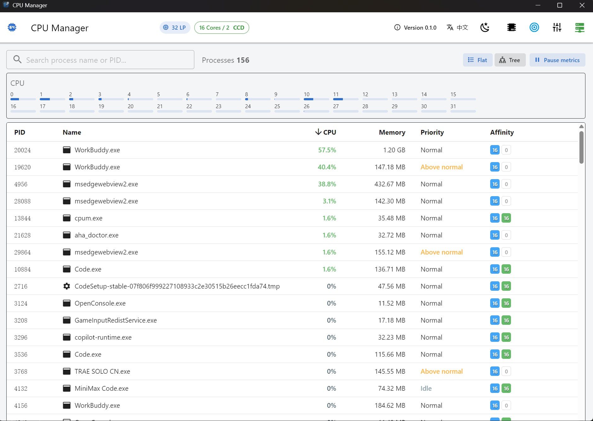
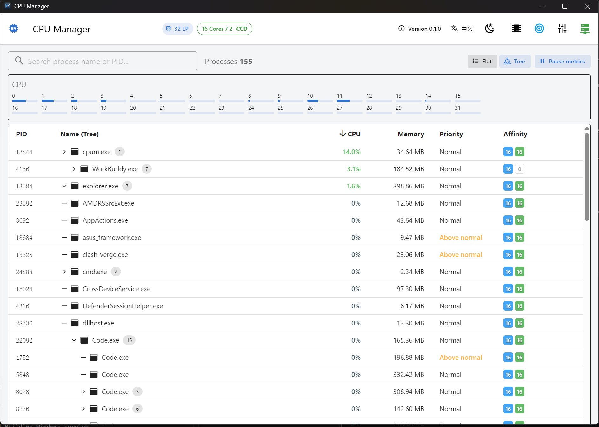
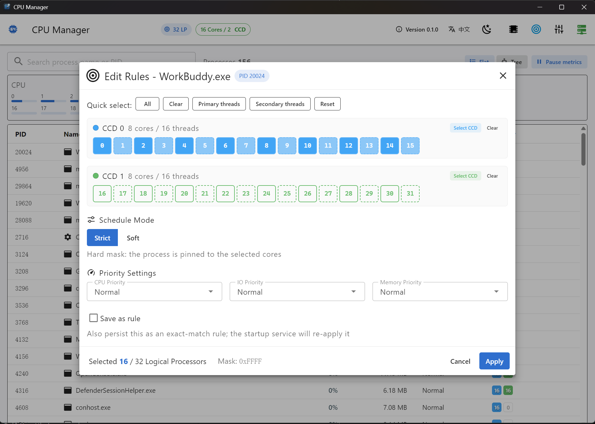
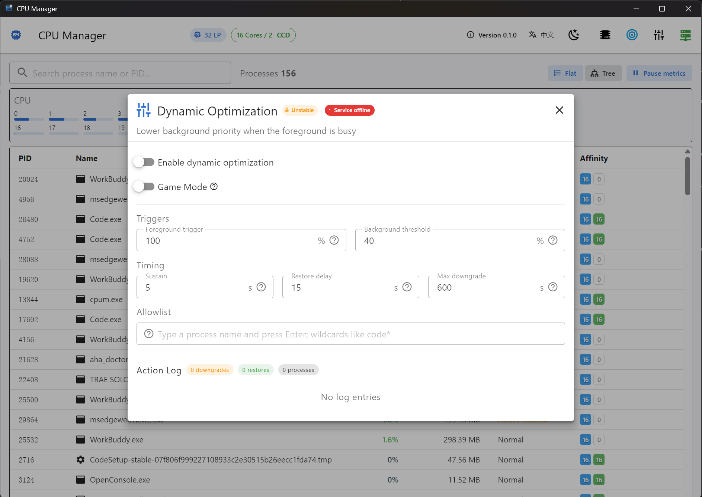

# CPU Manager

[English](README.md)

[](https://github.com/open-nexa/cpum/actions/workflows/ci.yml)
[](https://github.com/open-nexa/cpum/actions/workflows/codeql.yml)
[](LICENSE)

CPU Manager 是一款用于查看 CPU 拓扑、浏览 Windows 进程并管理其 CPU 亲和性、调度策略和优先级的桌面应用。项目采用 Vue 3 前端、Rust/Tauri 后端，并提供可选的 Windows 服务，用于在登录或重启后自动重新应用已保存的规则。同时内置了面向前台进程的 **ProBalance** 动态优化引擎，可在出现 CPU 争用时自动降级后台进程的优先级。

> 项目依赖 Windows API，仅支持 Windows。

[安装](#安装) · [界面截图](#界面截图) · [功能](#功能) · [规则、ProBalance 与服务](#规则probalance-与服务) ·
[开发](#开发) · [参与贡献](CONTRIBUTING.md) · [路线图](docs/ROADMAP.md) ·
[更新日志](CHANGELOG.md) · [发布说明](https://open-nexa.github.io/cpum/)

---

## 功能

- 查看 CPU 拓扑：逻辑处理器、物理核心、SMT 线程、CPU 插槽，以及可检测到的 CCD/Die 信息；保留 Intel 混合架构 P/E 核的区分。
- 以层级结构浏览运行中的进程，并实时显示 CPU、内存、磁盘以及（仅 Win11 24H2+）网络指标。
- 使用感知 CPU 拓扑的编辑器，为单个进程立即设置亲和性掩码。多处理器组系统按组分别管理掩码，不再局限于单一 64 位数值。
- 新增、启用、编辑、删除及手动应用持久化亲和性规则。
- 规则匹配模式：
  - **精确匹配（Exact）** — 不区分大小写的进程名（`.exe` 可省略），即 v1 行为。
  - **通配符（Wildcard）** — 对进程名使用 glob 模式（`code*`、`*steam*`、`?` 表示单个字符）。
  - **路径（Path）** — 对完整可执行路径使用 glob 模式（如 `C:\Games\*\game.exe`）。
- 规则调度模式：**严格（Strict，硬亲和性）** 或 **软（Soft，CPU Sets，Win10 1803+；负载高峰时调度器可临时漂移到其他核心）**。
- 规则可同时固定 **CPU 优先级类**、**I/O 优先级** 与 **内存优先级**。ProBalance 会自动将“由规则管理优先级”的进程排除在降级名单之外，避免与规则引擎相互干扰。
- ProBalance 动态优化：当检测到前台进程 CPU 持续超过阈值时，对超过阈值的后台进程临时降级（CPU 优先级类 + I/O 优先级），并在争用解除、进程退出或功能关闭时自动恢复。GUI 中可查看实时状态、统计数据和 JSONL 行为日志。
- 可安装 `CpumAffinityService` Windows 服务：该服务随系统自动启动，每 5 秒扫描一次匹配的进程，并同时承载 ProBalance 运行时；它同时充当**特权通道**，未提权的前台应用通过命名管道把受保护进程的修改交给它执行，全程无 UAC 弹窗。
- 规则与 ProBalance 配置保存在每用户数据目录 `%APPDATA%\com.open-nexa.cpum\`（`affinity_rules.json`、`probalance.json`、日志/状态文件）。旧位置（`%APPDATA%\com.eason.cpum`、`%ProgramData%\cpum`、`%APPDATA%\cpum`）下的文件会在安装或首次运行时自动迁移。

## 使用流程

1. 启动 CPU Manager，等待 CPU 拓扑和进程列表加载完成。
2. 在 **进程** 标签页为单个进程立即设置亲和性与优先级，或切换到 **规则** 标签页保存可复用规则。
3. 使用 **应用规则**，将所有已启用规则应用到当前运行的匹配进程。
4. 在 **ProBalance** 标签页配置前台争用阈值与白名单，并查看实时状态/日志。
5. 如果希望在登录或重启后也自动应用规则与 ProBalance，请在应用内安装 Windows 服务。

修改亲和性可能影响程序的响应速度和吞吐量。对于混合架构 CPU 或运行低延迟负载的电脑，请先谨慎测试掩码设置。ProBalance 仅降级后台进程的优先级，不会终止或硬绑定进程。

## 界面截图

<table>
  <tr>
    <td align="center"><br><sub>进程列表 — 平铺视图，右侧为每个 CCD 的亲和性色条</sub></td>
    <td align="center"><br><sub>进程列表 — 进程树视图</sub></td>
  </tr>
  <tr>
    <td align="center"><br><sub>规则管理器</sub></td>
    <td align="center"><br><sub>ProBalance 面板</sub></td>
  </tr>
</table>

更多截图与截图规格见 [screenshots/](screenshots/README.md)。

## 安装

请从 [最新发布](https://github.com/open-nexa/cpum/releases/latest) 下载与你 CPU
架构匹配的安装包；历史版本的下载链接见
[下载页](https://open-nexa.github.io/cpum/)：

| 架构 | 安装包 |
| --- | --- |
| x64 | `CPU-Manager_<版本>_windows-x64-setup.exe` |
| ARM64 | `CPU-Manager_<版本>_windows-arm64-setup.exe` |

**运行** CPU Manager 需要 Windows 10 或更高版本，以及 WebView2 Runtime（较新的
Windows 系统已自带）。安装包为 per-user 安装，默认装到 `%LOCALAPPDATA%`，
安装过程不会请求管理员权限。

### SmartScreen 与校验和

安装包目前还没有 Authenticode 签名——项目正在通过
[SignPath Foundation](https://signpath.org/) 申请免费证书（申请文案见
[docs/signpath-foundation-application.md](docs/signpath-foundation-application.md)）。
在签名证书接入发布流水线之前，首次运行安装包时 Windows 可能提示
**"Windows 已保护你的电脑"**，请选择 **更多信息 → 仍要运行**。

每个发布都附带 `SHA256SUMS.txt`，可以在运行前先校验下载到的文件：

```powershell
Get-Content .\SHA256SUMS.txt
(Get-FileHash .\CPU-Manager_v0.1.0_windows-x64-setup.exe -Algorithm SHA256).Hash.ToLower()
```

两个哈希值必须一致。若不一致，请删除该文件，切勿运行。

### 升级

**0.1.1 及更早**的安装版本会向项目此前所在的仓库检查更新，因此永远看不到新版本。
请手动安装一次 **0.2.0**，之后内置的更新器会接管，自动提示后续版本，并在安装前
校验 minisign 签名。

在 *应用和功能* 中卸载时，若已安装 `CpumAffinityService` 会一并移除。你的规则
文件保留在 `%APPDATA%\com.open-nexa.cpum\`。

## 开发环境要求

- Windows 10 或更高版本
- Node.js 与 npm
- npm（Tauri 开发钩子使用 `npm run dev`）
- 安装 MSVC 工具链的 Rust stable
- Microsoft C++ Build Tools / Visual Studio Build Tools（Rust Windows 工具链所需）
- WebView2 Runtime（通常已随较新的 Windows 系统提供）

桌面应用以调用者的普通权限运行（可执行文件内嵌 `asInvoker` 清单），安装包为 per-user NSIS 安装包，默认安装到 `%LOCALAPPDATA%`，安装过程无需 UAC 弹窗。只有 Windows 服务的管理操作（安装/卸载/启动/停止）需要管理员权限：这些命令会通过提权辅助进程执行，因此仅在该操作时弹出一次 UAC 提示。

由于前台应用不再提权，某些受 Windows 保护的进程，或属于其他安全上下文的进程，仍可能拒绝亲和性或优先级修改；安装以 `LocalSystem` 运行的服务即可覆盖这些场景。

## 开发

安装 JavaScript 依赖：

```powershell
npm ci
```

以开发模式运行应用：

```powershell
npx tauri dev
```

分别执行前端类型检查和 Rust 编译检查：

```powershell
npx vue-tsc --noEmit
cd src-tauri
cargo check
```

## 生产构建

发布脚本会刷新应用图标、构建前端、从 workspace 编译 `cpum_service.exe`，并生成 per-user（当前用户）NSIS 安装程序：

```powershell
.\build.bat
```

安装程序输出位置：

```text
src-tauri\target\release\bundle\nsis\CPU Manager_0.1.0_x64-setup.exe
```

也可以手动构建前端和 Tauri 安装包。必须先编译 `cpum_service.exe`，以便它能被 Tauri 作为打包资源引入（路径在 `tauri.conf.json` 中声明）：

```powershell
npm run build
cd src-tauri
cargo build --release -p cpum-service --bin cpum_service
cd ..
npx tauri build --bundles nsis
```

## 规则、ProBalance 与服务

### 规则 schema（v2）

规则文件使用 v2 信封格式，保存位置：

```text
%APPDATA%\com.open-nexa.cpum\affinity_rules.json
```

磁盘上的格式：

```json
{
  "version": 2,
  "rules": [
    {
      "id": "<uuid>",
      "process_name": "code",
      "mask": "0xFF",
      "group_masks": ["0xF", "0xF0"],
      "enabled": true,
      "created_at": 1736000000,
      "note": "前台进程绑到 P 核",
      "match_type": "exact",
      "mode": "strict",
      "priority_class": "0x80",
      "io_priority": 1,
      "memory_priority": 5
    }
  ]
}
```

- `group_masks` 可选；省略时 `mask` 视为传统的 group-0 值，旧规则文件仍可正常读取。
- `match_type` 取值为 `exact`（默认）、`wildcard` 或 `path`。
- `mode` 取值为 `strict`（默认）或 `soft`。
- `priority_class`、`io_priority`、`memory_priority` 均可缺省；缺省/为 `null` 表示“保持不变”。一旦设置了任意一个，ProBalance 会把匹配进程视为受保护，不会再降级其优先级。
- 旧版 v1 格式（裸 JSON 数组）仍可解析，读取时会自动补齐 v2 字段并在下一次保存时写回 v2 形式。

### Windows 服务

应用可安装、启动、停止和卸载 `CpumAffinityService`。该服务以 `LocalSystem` 身份运行、自动启动，安装时会收到规则目录参数（`%APPDATA%\com.open-nexa.cpum`），并同时承载规则引擎与 ProBalance 运行时。服务会尝试启用 `SeDebugPrivilege`，以便向用户会话中的进程应用规则。

提权范围仅限该操作：应用通过提权辅助进程调用 `sc.exe`，因此安装或卸载服务时只会弹出一次 UAC 提示，其余功能仍以普通权限运行。

可在 PowerShell 中验证服务安装状态：

```powershell
sc.exe qc CpumAffinityService
sc.exe query CpumAffinityService
Get-Content "$env:APPDATA\com.open-nexa.cpum\affinity_rules.json"
```

`Running` 仅表示服务正在运行，不能证明规则匹配到了进程，也不能证明 Windows 接受了亲和性掩码。排查问题时，请确认服务可执行文件路径与参数、规则文件以及目标进程的实际亲和性。

### 受保护进程的特权操作

前台应用以普通权限运行，对"属于其他账户"或"完整性级别更高"的进程调用 `OpenProcess` 会被拒绝（UAC 过滤令牌不含 `SeDebugPrivilege`）。此时按两级升级：

1. **服务通道（首选）** —— 请求通过命名管道 `\\.\pipe\cpum-bridge-v1` 转发给 `CpumAffinityService`。该服务以 `LocalSystem` 运行并持有 `SeDebugPrivilege`，因此完全无弹窗即可完成修改。**应用规则**中 GUI 处理不了的进程也会走这条路径。
2. **一次性提权（兜底）** —— 未安装服务时，用 `--set-affinity` / `--set-priority` 参数提权重启随包的 `cpum_service.exe`，那一次修改会弹一次 UAC。若某 PID 连这样都失败（PPL / 受保护的反作弊进程），本会话内将不再对它重复弹窗。

鉴权：管道 DACL 允许 SYSTEM 与交互式用户，但每个请求都必须带上随机令牌，令牌存放于 `%APPDATA%\com.open-nexa.cpum\bridge.token`，只有该用户（和 SYSTEM）能读。其他本地用户可以连上管道，但拿不到合法令牌。

注意 **PPL 进程根本无法修改**（管理员提权也不行），这类操作必定失败，错误会原样返回。

如需对规则进行一次性的诊断应用，可执行已安装的服务程序：

```powershell
& "<cpum_service.exe 的路径>" --apply-once "$env:APPDATA\com.open-nexa.cpum"
```

## 项目结构

```text
src/                              Vue 3 前端
  components/                     亲和性编辑器、规则管理器、ProBalance 面板
  composables/                    拓扑、进程、指标和进程树状态管理
  api.ts                          Tauri IPC 封装
  i18n.ts                         中英双语字典
src-tauri/                        Tauri 桌面二进制
  src/
    lib.rs                        Tauri 命令（拓扑、进程、规则、ProBalance）
    models.rs                     共享 serde 数据模型
    process/                      进程枚举、指标、采样
    topology.rs                   CPU 拓扑检测
  crates/
    cpum-core/                    规则模型、匹配器、存储、ProBalance、procwin
    cpum-service/                 cpum_service.exe（Windows 服务 + ProBalance 运行时）
  installer-hooks.nsh             NSIS 安装钩子：迁移旧版规则文件，仅服务操作提权
docs/
  ROADMAP.md                      现状、后续阶段与明确不做的事
  UPDATER.md                      密钥管理、发布产物与校验方式
  signpath-foundation-application.md  申请免费代码签名时使用的申请文本
  releases/                       下载页（通过 GitHub Pages 发布）
scripts/
  lint-i18n.mjs                   校验中英双语言字典是否同步
  snapshot-releases.mjs           刷新下载页的兜底数据
screenshots/                      README 截图；规格说明见该目录
.github/                          CI / CodeQL / Pages 工作流、Issue 与 PR 模板、dependabot
CONTRIBUTING.md                   构建环境、代码约定与上手任务清单
SECURITY.md                       权限边界与漏洞上报方式
CHANGELOG.md                      重要变更（Keep a Changelog 格式）
build.bat                         NSIS 发布构建脚本
```

## 注意事项与限制

- 多处理器组系统下，规则使用 `group_masks` 数组按组保存掩码；单值 `mask` 字段保留为传统的 group-0 视图，以兼容旧规则文件。
- 网络 I/O 计数器仅在 Win11 24H2+ 上可用（依赖 `NtQueryInformationProcess` / `ProcessNetworkIoCounters`），其他版本会显示为零。
- 保存规则后不会立即自动应用；请使用 **应用规则**，或等待服务检测到匹配进程。
- ProBalance 仅降级 CPU/IO 优先级，不会修改亲和性掩码；规则管理的优先级会被自动排除在 ProBalance 降级范围之外，避免两个引擎相互覆盖。

## 参与贡献

[CONTRIBUTING.md](CONTRIBUTING.md) 包含构建环境、代码约定和一份适合上手的
任务清单。提交 PR 前请先阅读——最容易踩的两条是：所有面向用户的文案必须同时
写入 `src/i18n.ts` 的**两个**语言包，以及注释只能使用英文。

## 安全

前台应用始终不提权，只有服务管理操作需要管理员权限；对于自身无法打开的进程，
GUI 通过命名管道交给服务处理，而不弹 UAC。
[SECURITY.md](SECURITY.md) 说明了这套权限边界、已知无法覆盖的场景（PPL 进程在
任何权限级别下都无法修改），以及漏洞的私下上报方式。

## 更新日志

重要变更记录在 [CHANGELOG.md](CHANGELOG.md)。

## 许可证

本项目使用 [MIT 许可证](LICENSE)。
